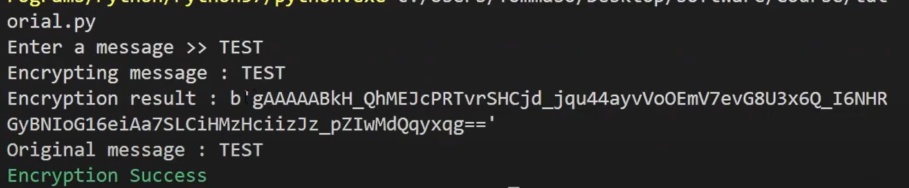
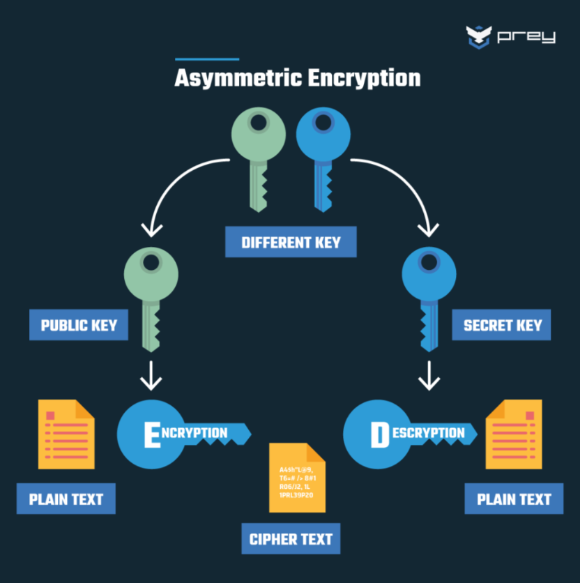

# Symmetric & Asymmetric Encryption 

## ❔ What is it

A better encryption type than the basic Caesar Cipher. Depending on your needs, one will have clear strengths and the other will have distinct weaknesses. Thus, I decided to make an encryptor and a decryptor for both Symmetric & Asymmetric encryption types!

---

## 👨🏻‍💻 Dev Process

### Symmetric Encryption:

<div align="center">
  
</div>

I'm using python to program both types of encryption. 

First, install the cryptography library:  
```pip install cryptography ```

Then, import Fernet and colored libraries:  
```from cryptography.fernet import Fernet``` 
```from termcolor import colored```

Lastly, code in the key generator for the Symmetric Encryptor.

Here is the result:

<div align="center">
  
</div>

---

### Asymmetric Encryption:

<div align="center">
  
</div>

---

## 🕵️‍♂️ More...

Find more on this here: https://preyproject.com/blog/types-of-encryption-symmetric-or-asymmetric-rsa-or-aes#:~:text=Symmetric%20encryption%20involves%20using%20a,specific%20needs%20of%20the%20user.


